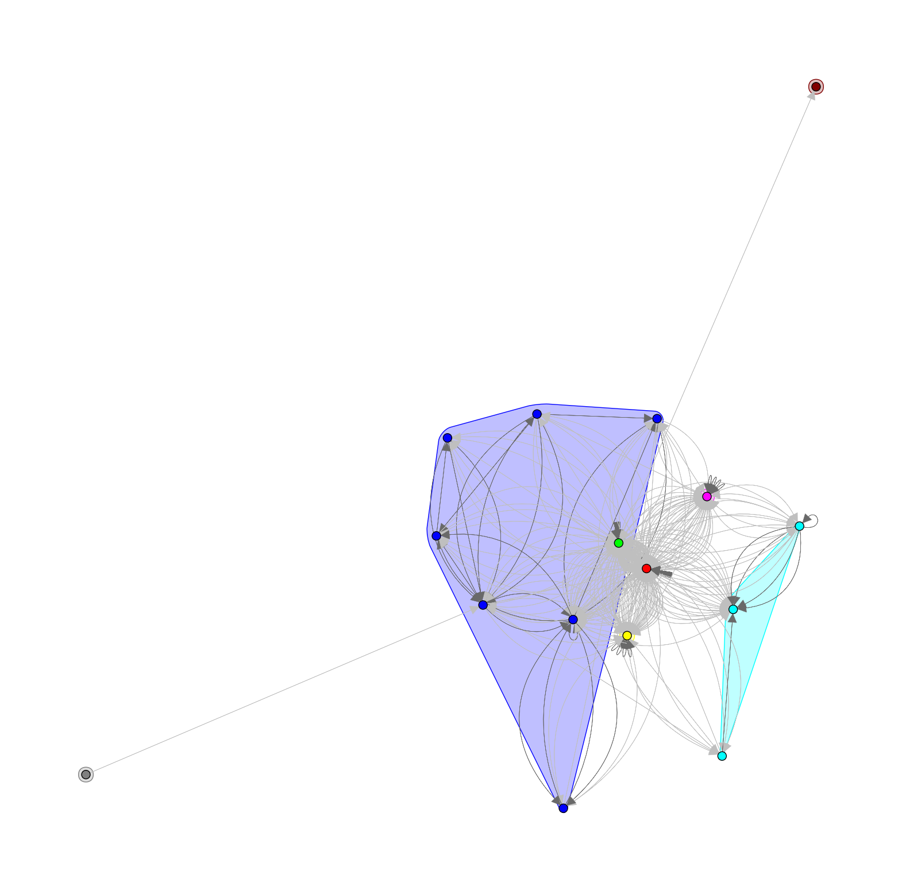

# ig_degree_betweenness_py

[](https://pypi.org/project/ig-degree-betweenness/)
[](https://pepy.tech/projects/ig-degree-betweenness)
[](https://arxiv.org/abs/2411.01394)
[](https://doi.org/10.33137/utjph.v5i1.44130)
[](https://doi.org/10.1002/cjs.70060)


Python implementation of the Smith-Pittman Algorithm available in the [`ig.degree.betweenness`](https://github.com/benyamindsmith/ig.degree.betweenness/) R package.

For the C implementation see [`ig_degree_betweenness_c`](https://github.com/benyamindsmith/ig_degree_betweenness_c).

This code can be used both as a standard Python library for scripting and as a command-line tool.

<a> 

</a>


<a> 

</a>

# Installation

To install from PyPI, run:

```sh
pip install ig-degree-betweenness
```

To install from GitHub, run. 

```sh
pip install git+https://github.com/benyamindsmith/ig_degree_betweenness_py.git
```
# Usage

## Scripting Usage

To use this in a typical scripting setting compute the clustering with the following code. 

```python 
import igraph as ig
from ig_degree_betweenness import community_degree_betweenness
import matplotlib.pyplot as plt


# Read edges
with open("edgelist.txt", "r") as f:
    edges = [tuple(line.strip().split("\t")) for line in f]

# Build graph with directed flag
g = ig.Graph.TupleList(edges, directed=True)

# Compute clustering
sp_clustering = community_degree_betweenness(g)
```

This can be further visualized:

```py
# Visualize Communities
fig1, ax1 = plt.subplots()
ig.plot(
    sp_clustering,
    target=ax1,
    mark_groups=True,
    vertex_size=15,
    edge_width=0.5,
)
fig1.set_size_inches(20, 20)
```



To run this code in the terminal on an input edge list in [NCOL](https://igraph.org/c/html/0.9.7/igraph-Foreign.html) format that is tab separated (see simulated dataset of *edgelist.txt*), run: 

## Terminal Usage

```sh
# for an undirected graph (default)
$ python ig_degree_betweenness edgelist.txt

# for a directed graph
$ python ig_degree_betweenness -d edgelist.txt

```

# Citation

To cite package ‘ig.degree.betweenness’ in publications use:

>  Smith B, Pittman T, Xu W (2024). “Centrality in Collaboration: community detection
  for oncology researchers.” _University of Toronto Journal of Public Health_,
  *5*(1). doi:10.33137/utjph.v5i1.44130
> 
> Smith B, Pittman T, Xu W (2026). “Detecting communities when order and direction
  matter in social network analysis.” _Canadian Journal of Statistics_, *n/a*(n/a),
  e70060. doi:10.1002/cjs.70060

A BibTeX entry for LaTeX users is

```
  @Article{Smith_Pittman_Xu_2024,
    title = {Centrality in Collaboration: community detection for oncology researchers},
    author = {Benjamin Smith and Tyler Pittman and Wei Xu},
    journal = {University of Toronto Journal of Public Health},
    volume = {5},
    number = {1},
    year = {2024},
    month = {nov},
    doi = {10.33137/utjph.v5i1.44130},
    url = {https://utjph.com/index.php/utjph/article/view/44130},
  }
  
   @Article{Smith_Pittman_Xu_2026,
    title = {Detecting communities when order and direction matter in social network analysis},
    author = {Benjamin Smith and Tyler Pittman and Wei Xu},
    journal = {Canadian Journal of Statistics},
    volume = {n/a},
    number = {n/a},
    pages = {e70060},
    year = {2026},
    doi = {https://doi.org/10.1002/cjs.70060},
    url = {https://onlinelibrary.wiley.com/doi/abs/10.1002/cjs.70060},
    eprint = {https://onlinelibrary.wiley.com/doi/pdf/10.1002/cjs.70060},
    keywords = {Community detection, directed networks, edge betweenness, modularity, node degree},
  }
```

